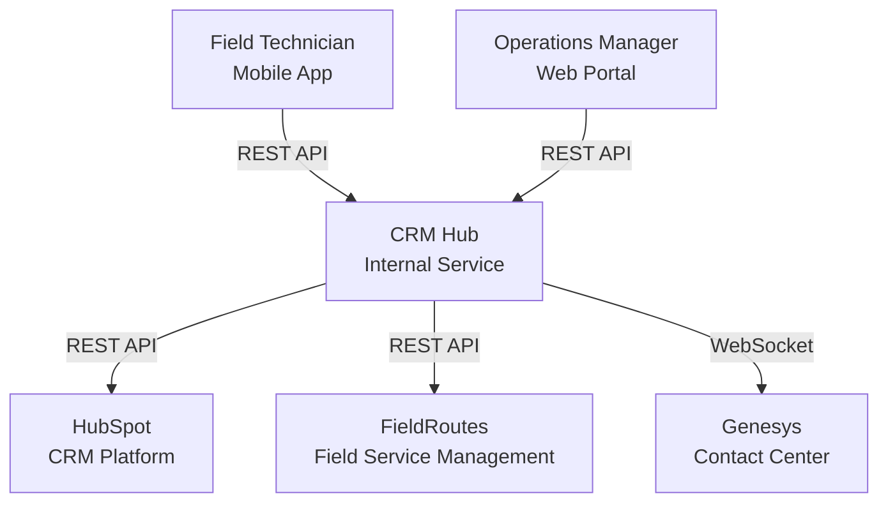
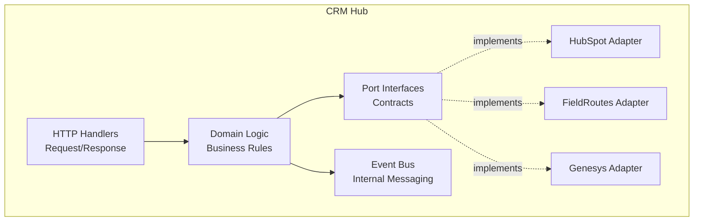
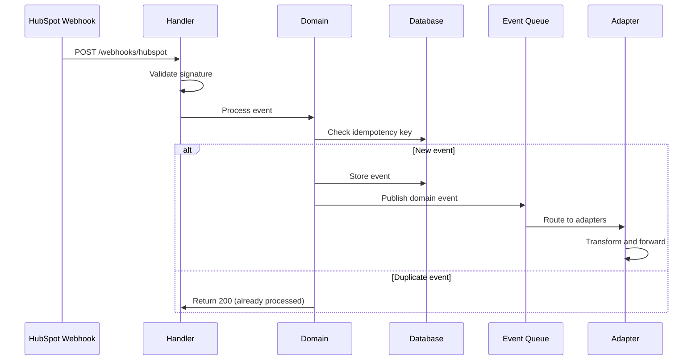
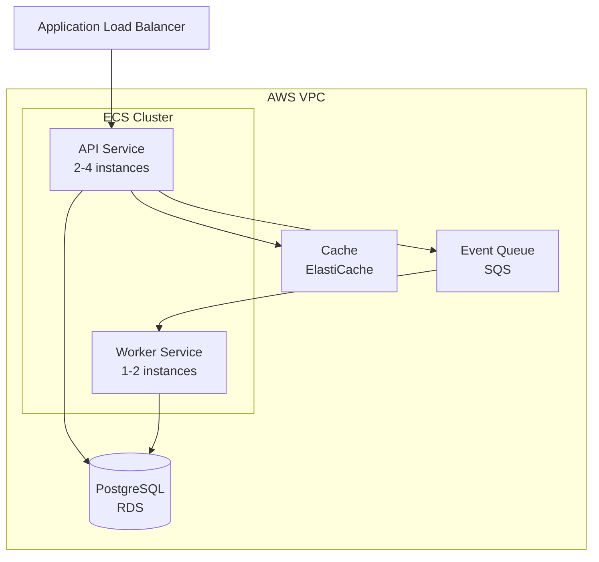

# Baseline Architecture Diagrams (Four Diagrams Reference)

> **Chapter:** ch04 — Foundations (Section 4.3, "Architecture as
> First-Class Artifact")
> **Last revised:** 2026-06-16
> **Use this for:** The four baseline Mermaid diagrams every
> agent-ready project should maintain. Stored as code, referenced
> from `CLAUDE.md`, updated as part of architectural changes.

Architecture diagrams in most organizations live in Confluence pages,
Miro boards, Lucidchart files, and PowerPoint decks. Six months later,
the diagram shows four services; the system has seven. The diagram is
not wrong in the way a bug is wrong. It is wrong in the way an
expired map is wrong — **it describes a territory that no longer
exists**.

In the agentic era this becomes a crisis. When the agent has no
architecture context, it makes decisions based on patterns from its
training data — patterns that are reasonable in general but wrong
for your system.

The solution is **architecture diagrams stored as code** — Mermaid
files (`.mmd`) checked into the repository and referenced from the
context file. Mermaid renders as a visual diagram for human review,
and parses as structured text for AI consumption. The agent reads
the file and understands the system's structure, boundaries, and
data flows as effectively as a human understanding the rendered
image.

---

## 1. System Context Diagram

**Answers:** *What is this system, and what does it interact with?*

Shows the system as a single box surrounded by external actors. The
highest-level view. Provides the agent with essential orientation:
**what is inside the boundary, and what is outside.**



**Prevents the agent from:**
- Treating external systems as internal modules (importing their
  types directly, calling endpoints without an adapter layer)
- Creating new external integrations the specification did not
  authorize

---

## 2. Component Diagram

**Answers:** *What are the major pieces inside the system, and how do
they relate?*

Shows internal modules, their responsibilities, and the dependencies
between them. **The diagram that defines architecture boundaries —
the lines the agent must not cross.**



**Prevents the agent from:**
- Violating the dependency direction (handlers importing from
  adapters, domain importing from infrastructure)
- Creating circular dependencies between modules
- Placing code in the wrong module

---

## 3. Data Flow Diagram

**Answers:** *How does data move through the system?*

Traces the path of key data entities from ingestion through
processing to storage and output. Critical because **data flow
violations are among the subtlest and most expensive defects in
generated code.**



**Prevents the agent from:**
- Short-circuiting the flow (writing directly to the database from a
  handler, skipping the idempotency check)
- Creating new data paths that bypass validation or authorization
- Introducing data transformations at the wrong layer

---

## 4. Deployment Diagram

**Answers:** *How is this system deployed, and what are the runtime
boundaries?*

Shows containers, services, databases, queues, and the network
topology that connects them.



**Prevents the agent from:**
- Generating code that assumes co-located services (shared
  filesystem, shared memory)
- Creating synchronous calls where the deployment topology requires
  asynchronous communication
- Ignoring operational constraints (connection pools, timeout
  budgets, scaling characteristics)

---

## Storage Convention

Store these as four files in your repository's `diagrams/`
directory:

```
diagrams/
├── system-context.mmd
├── component.mmd
├── data-flow.mmd
└── deployment.mmd
```

Reference them from `CLAUDE.md`:

```markdown
## Architecture Boundaries
- See diagrams/system-context.mmd and diagrams/component.mmd for
  visual reference
- See diagrams/data-flow.mmd for the canonical inbound data path
- See diagrams/deployment.mmd for runtime topology
```

## Maintenance Discipline

Architecture diagrams, like context files, are only valuable when
they reflect reality. **Every PR that changes the architecture must
include a corresponding update to the affected diagrams.**

Add a checklist item to your PR template:

```markdown
## Architecture Impact

- [ ] No architecture impact, OR
- [ ] System Context updated (diagrams/system-context.mmd)
- [ ] Component diagram updated (diagrams/component.mmd)
- [ ] Data Flow updated (diagrams/data-flow.mmd)
- [ ] Deployment diagram updated (diagrams/deployment.mmd)
- [ ] Architecture impact noted in DESIGN.md
```

## Related

- `../spec-templates/claude-md-template.md` — references these
  diagrams from the Architecture Boundaries section
- `../checklists/impact-boundary-assessment.md` — Q5 asks whether
  this change requires updating the diagrams
- `merlin-architecture-v2.md` — the worked example of a
  code-grounded architecture document at scale

## Provenance

Adapted from Chapter 4 of *Harnessing the Horse*, Section 4.3. The
four baseline diagrams are the book's minimum-viable architecture
documentation set.

© 2026 John Briggs. Licensed under CC BY-NC-SA 4.0 (see LICENSE-CONTENT). Commercial use requires separate written permission.
