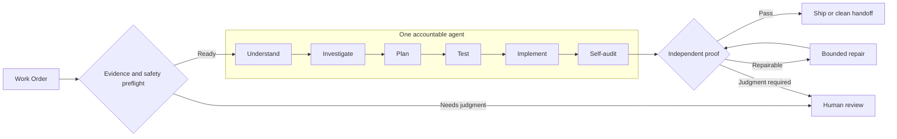
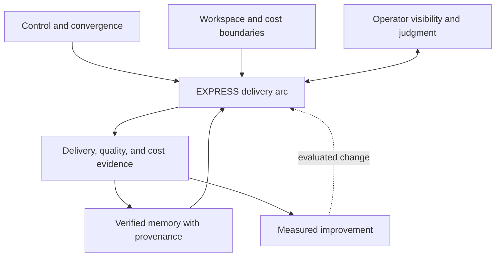

# Merlin Software Factory: Public Teaching Architecture

This chapter companion presents the current Merlin operating model at the
level readers need to understand and apply it. It is intentionally an
architectural teaching abstraction, not an implementation map.

The central idea is simple: **one accountable agent owns the complete delivery
arc**, while deterministic controls, independent verification, durable state,
human judgment, and post-run learning surround that agent.

## Public Abstraction Boundary

The public edition explains responsibilities, evidence flow, and decision
boundaries. It intentionally excludes:

- private source filenames and module topology;
- model-provider selection and fallback order;
- tool, route, schema, migration, and page inventories;
- storage-engine configuration and deployment topology;
- internal prompts, thresholds, and operational runbooks.

Those details evolve faster than the book's durable engineering principles and
are not required to apply the pattern.

## 1. Operating Model

The work order is the unit of accountability. Before an agent turn begins, a
deterministic preflight checks whether the work is sufficiently bounded,
whether consequential decisions have evidence, whether the workspace is
usable, and whether execution remains inside its approved safety and cost
envelope.

If the work is ready, one agent owns the arc from understanding through
self-audit. That continuity is deliberate: design reasoning, test intent, code
changes, and proof stay in one working context instead of degrading across a
chain of specialized handoffs.

## 2. The EXPRESS Arc

| Phase | Reader-facing responsibility | Evidence produced |
| --- | --- | --- |
| Understand | Restate the outcome, constraints, and acceptance conditions. | A bounded interpretation of the work order. |
| Investigate | Read the relevant system before proposing changes. | Current-state evidence and affected boundaries. |
| Plan | Declare the intended change surface and proof strategy. | A scoped plan with explicit risks and checks. |
| Test | Turn expected behavior into executable evidence. | Failing or characterizing tests where appropriate. |
| Implement | Make the smallest coherent change that satisfies the plan. | A reviewable change set with traceable intent. |
| Self-audit | Challenge the result before claiming completion. | Test results, static evidence, limitations, and handoff context. |

The phases are a disciplined reasoning arc, not six independent agents or six
mandatory process handoffs.

## 3. Verification Policy

The factory does not treat every quality concern identically. Verification is
classified by consequence:

| Classification | Meaning | Typical outcome |
| --- | --- | --- |
| Blocking | Failure would make the change unsafe or untrustworthy. | Stop or enter bounded repair. |
| Conditional | The check becomes blocking when the work declares that concern. | Verify when applicable; record why otherwise. |
| Advisory | The signal improves judgment but should not manufacture delivery friction. | Record the finding and continue when safe. |
| Asynchronous | The work improves future runs but should not block the current delivery. | Run after the delivery decision. |

Independent proof matters because the implementing agent cannot be the only
judge of its own claim. Deterministic checks and a separate reading challenge
overclaims, while human review remains an explicit healthy outcome when product,
risk, or operational judgment exceeds automation.

## 4. Supporting Planes

### Control and convergence

A control loop compares desired and actual work-order state, resumes recoverable
work, and stops repeated failure rather than allowing invisible or unbounded
execution.

### Workspace and cost boundaries

Each work order runs inside a bounded workspace and budget. Hard limits,
no-progress detection, and approval boundaries convert runaway automation into
an observable handoff.

### Operator visibility

Operators can inspect status, evidence, cost, failures, and next actions. Human
review is not a failure state; it is the correct terminal outcome when a person
must decide what evidence alone cannot.

### Observability

Delivery, quality, cost, recovery, and adoption signals show whether a change
actually holds after the agent's turn. These signals feed governance and later
improvement rather than serving as decorative dashboards.

### Memory and improvement

Verified lessons carry provenance and must be checked against current reality
before reuse. Retrospectives, memory encoding, and improvement experiments run
outside the critical delivery path whenever possible. A proposed change to the
factory earns promotion through measured evidence, not enthusiasm.

## 5. Reader Takeaway

The reusable pattern is not Merlin's private implementation. It is the division
of responsibility:

1. Bound the work before execution.
2. Give one capable agent end-to-end ownership.
3. Preserve rigor with deterministic and independent proof.
4. Escalate judgment instead of fabricating certainty.
5. Keep state, cost, and recovery observable.
6. Let verified learning improve future runs without blocking the current one.

For the visual sequence, begin with the
[premium overview](merlin-factory-architecture-premium.png), then use the
[five-panel teaching set](merlin-architecture-v2-visual.html).
