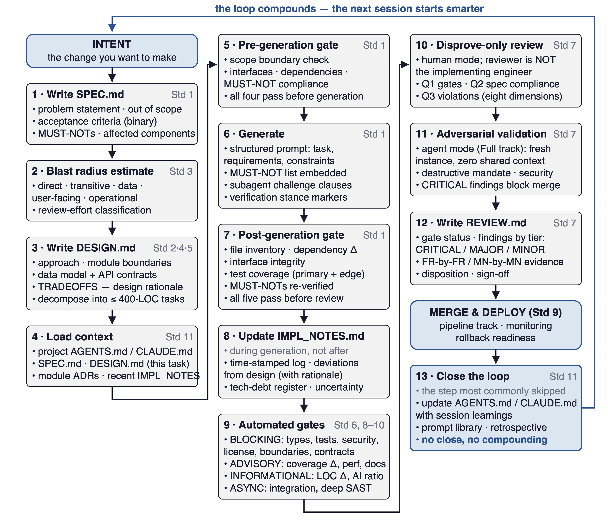
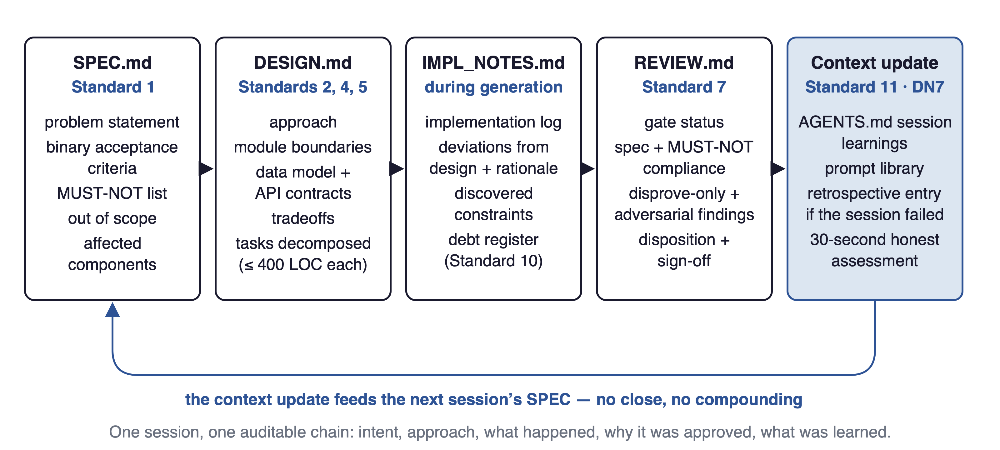

# The Complete Session Loop

The single-page workflow reference for an agentic development
session, from intent to closed loop. Print this page and pin
it near your workstation; everything in the book reduces to
running this loop with discipline.

This online reference replaces the former print appendix and
is the canonical version of the loop.



---

## The Loop

```
                          ┌───────────────────────┐
                          │   INTENT (the change  │
                          │   you want to make)   │
                          └──────────┬────────────┘
                                     │
                                     ▼
       ┌─────────────────────────────────────────────────────────┐
       │  1. WRITE SPEC.md (Standard 1)                          │
       │     • Problem Statement                                 │
       │     • Proposed Solution                                 │
       │     • Acceptance Criteria (binary, machine-readable)    │
       │     • MUST-NOT List (six categories)                    │
       │     • Out of Scope                                      │
       │     • Affected Components                               │
       └─────────────────────────────┬───────────────────────────┘
                                     │
                                     ▼
       ┌─────────────────────────────────────────────────────────┐
       │  2. BLAST RADIUS ESTIMATE (Standard 3, SPEC-time)       │
       │     • Five dimensions: direct, transitive, data,        │
       │       user-facing, operational                          │
       │     • Review effort classification                      │
       └─────────────────────────────┬───────────────────────────┘
                                     │
                                     ▼
       ┌─────────────────────────────────────────────────────────┐
       │  3. WRITE DESIGN.md (Standards 2, 4, 5)                 │
       │     • Approach (1–2 paragraphs)                         │
       │     • Module Boundaries (no boundary violations)        │
       │     • Data Model + API Contracts                        │
       │     • TRADEOFFS (the design-rationale record)           │
       │     • Decompose into agent-sized tasks (≤ 400 LOC each) │
       └─────────────────────────────┬───────────────────────────┘
                                     │
                                     ▼
       ┌─────────────────────────────────────────────────────────┐
       │  4. LOAD CONTEXT (Standard 11)                          │
       │     • AGENTS.md / CLAUDE.md (project context)           │
       │     • SPEC.md, DESIGN.md (this task's context)          │
       │     • Relevant ADRs surfaced by module path             │
       │     • Recent IMPL_NOTES entries for the affected module │
       └─────────────────────────────┬───────────────────────────┘
                                     │
                                     ▼
       ┌─────────────────────────────────────────────────────────┐
       │  5. PRE-GENERATION GATE (Standard 1)                    │
       │     • Scope Boundary check                              │
       │     • Interface Contracts check (no hallucinated APIs)  │
       │     • Dependency Check (no unauthorized packages)       │
       │     • Constraint Check (MUST-NOT compliance)            │
       │     ────  All four must pass before generation ─────    │
       └─────────────────────────────┬───────────────────────────┘
                                     │
                                     ▼
       ┌─────────────────────────────────────────────────────────┐
       │  6. GENERATE (Standard 1 — structured prompt)           │
       │     • Task / Functional Requirements / Constraints      │
       │     • MUST-NOT List embedded in the prompt              │
       │     • Subagent challenge clauses (Chapter 7)            │
       │     • Verification stance markers (Chapter 7)           │
       └─────────────────────────────┬───────────────────────────┘
                                     │
                                     ▼
       ┌─────────────────────────────────────────────────────────┐
       │  7. POST-GENERATION GATE (Standard 1)                   │
       │     • File Inventory (no unexpected files)              │
       │     • Interface Integrity (no unauthorized changes)     │
       │     • Dependency Delta (every change accounted for)     │
       │     • Test Coverage (primary + edge for each public IF) │
       │     • MUST-NOT Verification (re-check every item)       │
       │     ────  All five must pass before review ─────        │
       └─────────────────────────────┬───────────────────────────┘
                                     │
                                     ▼
       ┌─────────────────────────────────────────────────────────┐
       │  8. UPDATE IMPL_NOTES.md (during generation, not after) │
       │     • Implementation log entries (time-stamped)         │
       │     • Deviations from design (with rationale)           │
       │     • Discovered constraints                            │
       │     • Tech debt register (Std 10) — three severity tiers│
       │     • Agent uncertainty entries                         │
       └─────────────────────────────┬───────────────────────────┘
                                     │
                                     ▼
       ┌─────────────────────────────────────────────────────────┐
       │  9. AUTOMATED GATES (Standards 6, 8–10) — four tiers   │
       │     • Type check, unit tests, security scan, license,   │
       │       architecture boundaries, API contract (BLOCKING)  │
       │     • Coverage delta, complexity, perf regression,      │
       │       documentation (ADVISORY)                          │
       │     • LOC delta, dependency inventory, test execution   │
       │       time, AI-generation ratio (INFORMATIONAL)         │
       │     • Full integration, deep SAST, perf benchmarks,     │
       │       transitive vuln scan (ASYNC — before merge)       │
       └─────────────────────────────┬───────────────────────────┘
                                     │
                                     ▼
       ┌─────────────────────────────────────────────────────────┐
       │ 10. DISPROVE-ONLY REVIEW (Standard 7, human mode)       │
       │     Reviewer is NOT the implementing engineer.          │
       │     Three questions answered with evidence:             │
       │       Q1. Automated gate status                         │
       │       Q2. Specification compliance (AC-by-AC)           │
       │       Q3. Specification violations (eight dimensions)   │
       └─────────────────────────────┬───────────────────────────┘
                                     │
                                     ▼
       ┌─────────────────────────────────────────────────────────┐
       │ 11. ADVERSARIAL VALIDATION (Standard 7, agent mode —    │
       │     Full track). Fresh agent instance, zero shared      │
       │     context. Destructive mandate. Security audit.       │
       │     Verification stance audit. CRITICAL findings        │
       │     auto-block merge.                                   │
       └─────────────────────────────┬───────────────────────────┘
                                     │
                                     ▼
       ┌─────────────────────────────────────────────────────────┐
       │ 12. WRITE REVIEW.md (Standard 7)                        │
       │     • Gate Status (each gate PASS/FAIL)                 │
       │     • Specification Compliance (AC-by-AC with evidence) │
       │     • MUST-NOT Compliance (MN-by-MN with evidence)      │
       │     • Disprove-Only Findings (CRITICAL / MAJOR / MINOR) │
       │     • Adversarial Validation Findings + Disposition     │
       │     • Disposition: Approved / w/ Conditions / Revise /  │
       │       Rejected                                          │
       │     • Sign-off                                          │
       └─────────────────────────────┬───────────────────────────┘
                                     │
                                     ▼
                          ┌──────────────────────┐
                          │   MERGE & DEPLOY     │
                          │   (Standard 9)      │
                          │   Pipeline track,    │
                          │   monitoring,        │
                          │   rollback readiness │
                          └──────────┬───────────┘
                                     │
                                     ▼
       ┌─────────────────────────────────────────────────────────┐
       │ 13. CLOSE THE LOOP (Standard 11 — DN7; the step         │
       │     most commonly skipped)                              │
       │     • Update AGENTS.md / CLAUDE.md with session         │
       │       learnings and any new project convention          │
       │     • Update prompt library if a prompt pattern emerged │
       │     • Write retrospective entry if the session failed   │
       │     • Honest assessment (30-second note per Std 11)     │
       │     ────  Closing the loop is what makes the next       │
       │           session smarter. No close, no compounding.    │
       └─────────────────────────────────────────────────────────┘
```



---

## The Three Rules

When the loop feels heavy, remember the three rules that
matter most:

1. **No SPEC, no generation.** If you cannot write the
   acceptance criteria, you do not know what you are asking
   for. The agent will fill the gap with assumptions. Reading
   25 lines of SPEC is faster than reviewing 250 lines of
   misaligned code.

2. **No review by the generator.** Standard 7's agent mode is
   the structural form of this rule. The shorter form: if you
   wrote the prompt, you should not be the only person
   reviewing the output. Adversarial validation in a fresh
   agent instance is the operational compromise when no
   second human is available.

3. **Close the loop.** Every session ends with an update to
   `AGENTS.md` or a refined prompt or a new ADR or a fixed
   convention. If the session ended without changing
   anything that will help the next session, the next session
   is starting from the same place. Compounding requires
   updating something.

---

## When You Skip a Step

Each step in the loop corresponds to a class of failure mode
in production. Skipping the step does not eliminate the
failure; it just delays detection.

| Skipped step | Failure mode that surfaces later |
| --- | --- |
| 1. SPEC.md | Agent generates plausible-but-wrong code; regeneration rate climbs |
| 2. Blast radius | Reviewer cannot calibrate effort; either over-reviews trivial change or under-reviews dangerous one |
| 3. DESIGN.md | Agent makes architectural decisions; consistency drifts across sessions |
| 4. Context load | Agent generates code that violates project conventions invisibly |
| 5. Pre-gen gate | Hallucinated interfaces survive into the generated code |
| 6. Structured prompt | Scope drift; missing MUST-NOT list reliably predicts drift |
| 7. Post-gen gate | Unauthorized files / dependencies / interface changes reach review |
| 8. IMPL_NOTES | Reviewer cannot tell which choices were deliberate; tech debt becomes dark code |
| 9. Automated gates | Type errors, security findings, license issues, boundary violations reach merge |
| 10. Disprove-only review | Confirmation bias produces "LGTM"; specification violations ship |
| 11. Adversarial validation | Race conditions, replay attacks, resource leaks reach production |
| 12. REVIEW.md | Postmortem cannot reconstruct why this code was approved |
| 13. Close the loop | Next session reproduces every mistake of this one |

The discipline is skipping steps deliberately, knowing which
failure mode you have accepted. A hotfix track skips DESIGN.md
because the change is too small to need one — the team has
accepted that skipping carries the risk above, and the risk
is bounded by the change's size. A full track skips nothing.

---

The loop is the book's organizing artifact. Every chapter
describes one or more steps in detail. The templates, prompts,
and checklists in the companion repository are the
operational implementations of each step.
The loop is what ties them together.

Print this page. Pin it. Run it.
